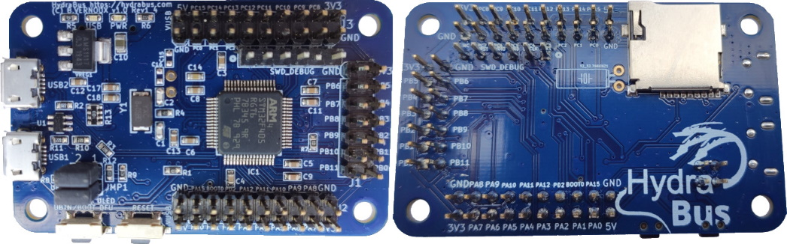
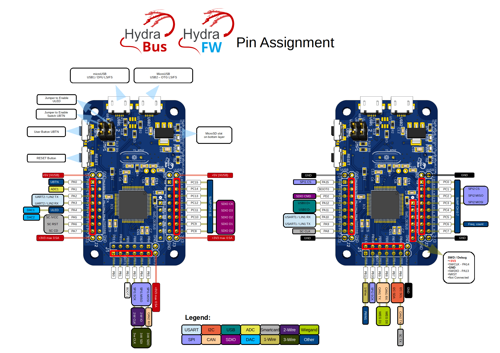

HydraFW official firmware for HydraBus v1
========

HydraFW is a native C (and asm) open source firmware for HydraBus v1 board.

You can Buy HydraBus v1 Online: http://hydrabus.com/buy-online

* Getting Started with HydraBus v1: https://github.com/hydrabus/hydrafw/wiki/Getting-Started-with-HydraBus
* HydraFW Wiki: https://github.com/hydrabus/hydrafw/wiki
* HydraFW usage with VT100 Terminal see wiki https://github.com/hydrabus/hydrafw/wiki/HydraFW-commands
* For more details on HydraBus v1 Hardware and Firmware see also: https://github.com/hydrabus/hydrabus
* For more details on HydraNFC Shield v2 see: https://github.com/hydrabus/hydrafw_hydranfc_shield_v2
* If you want to help on this project see:
  * [Coding Styles](https://github.com/hydrabus/hydrafw/blob/master/CODING_STYLE.md), [Wiki](https://github.com/hydrabus/hydrafw/wiki) & [Wiki Task List](https://github.com/hydrabus/hydrafw/wiki/Task-List) 
  * [Developer Getting-Started with HydraBus and STM32CubeIDE Windows & Linux](https://github.com/hydrabus/hydrafw/wiki/Getting-Started-with-HydraBus-and-STM32CubeIDE)
  * [How to Build/Flash/Use HydraFW on Windows](https://github.com/hydrabus/hydrafw/wiki/how-to-build-flash-and-use-hydrafw-on-windows)
  * [How to Build/Flash/Use HydraFW on Linux](https://github.com/hydrabus/hydrafw/wiki/how-to-build-flash-and-use-hydrafw-on-linux)
