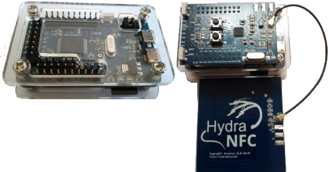
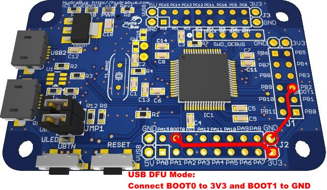

HydraFW official firmware for HydraBus/HydraNFC
========

HydraFW is a native C (and asm) open source firmware for HydraBus board with support of HydraNFC Shield.

You can Buy HydraBus/HydraNFC Online in Seeed Studio Online Shop:
http://www.seeedstudio.com/depot/HydraBus-m-132.html

I recommend Putty for terminal to be used with HydraBus connected with USB1 or 2
When connected type h for help and use TAB key for completion,
you can also use arrow up or down for history.
mount, umount, ls, cat & erase work only when a micro SD card is inserted in HydraBus.

##HydraFW supported commands in v0.1Beta for HydraBus:

    ? or h         - Help
    clear          - clear screen
    info           - info on FW & HW
    ch_mem         - memory info
    ch_threads     - threads
    ch_test        - chibios tests
    mount          - mount sd
    umount         - unmount sd
    ls [opt dir]   - list files in sd
    cat <filename> - display sd file (ASCII)
    erase          - erase sd
    Those commands are very basic and more will come later to read/write on I2C, SPI, UART...

##HydraFW additional commands in v0.1Beta for HydraBus+HydraNFC(HydraNFC detected):

    nfc_mifare     - NFC read Mifare/ISO14443A UID
    nfc_vicinity   - NFC read Vicinity UID
    nfc_dump       - NFC dump registers
    nfc_sniff      - NFC start sniffer ISO14443A
    nfc_sniff can be started by K3 and stopped by K4 buttons

##How to build, flash and use hydrafw on windows:

    1) PowerOff HydraBus board (disconnect all USB)
    2) Connect HydraBus pin BOOT0 to 3V3 (using a dual female splittable jumper wire) to enter USB DFU
    3) Connect MicroUsb cable from PC to HydraBus USB1 board, now windows shall detect a new device
       (if you have problem to detect the device use an USB1.1 or 2.0 Hub
          as there is problem with USB3.0 port on some computer and windows version).
    4) Download the USB DFU driver from directory https://github.com/bvernoux/hydrabus/firmware/STM32F4_USB_DFU_Driver.zip
     4-1) Extract the archive and install the drivers.
    5) Launch from current directory update_fw_usb_dfu_hydrabus.bat (will flash latest firmware during about 10s)
    6) Disconnect MicroUsb cable from HydraBus and Disconnect "BOOT0 to 3V3"
    7) Reconnect MicroUsb cable on USB1 or USB2(both port are supported), Now hydrafw is started.

When hydrafw is executed on Windows you need to install STM32 Virtual COM Port Driver (only the first time) from:
http://www.st.com/web/en/catalog/tools/PF257938

The firmware is set up for compilation with the GCC toolchain GNU_ARM_4_7_2013q3 available here:
https://launchpad.net/gcc-arm-embedded/+milestone/4.7-2013-q3-update

Required dependencies:

    Custom chibios (based on ChibiOS 3.0) included as Submodule.
    Custom microrl included as Submodule.

To build hydrafw firmware (with mingw or cygwin):

    cd in root directory(which contains directories common, fatfs, hydrabus, hydranfc ...)
    make clean
    make

##How to build, flash and use hydrafw on Linux (Debian/Ubuntu):

###Prerequisites for Linux:

    cd ~
    sudo apt-get install git dfu-util python putty
    wget http://www.bialix.com/intelhex/intelhex-1.4.zip
    unzip intelhex-1.4.zip
    cd intelhex-1.4
    sudo python setup.py install
    http-get https://launchpad.net/gcc-arm-embedded/4.7/4.7-2013-q3-update/+download/gcc-arm-none-eabi-4_7-2013q3-20130916-linux.tar.bz2
    tar xjf gcc-arm-none-eabi-4_7-2013q3-20130916-linux.tar.bz2
    echo 'PATH=$PATH:~/gcc-arm-none-eabi-4_7-2013q3/bin' >> ~/.bashrc
    git clone https://github.com/bvernoux/hydrabus.git hydrabus
    cd hydrabus/
    git submodule init
    git submodule update

###Build hydrafw on Linux:

    cd ~/hydrabus/firmware/hydrafw
    make clean
    make

###Flash and use hydrafw on Linux:

    cd ~/hydrabus/firmware/hydrafw
    python dfu-convert.py -i ./build/hydrafw.hex ./build/hydrafw.dfu
    read -p "`echo -e '\nConnect HydraBus pin BOOT0 to 3V3 (using a dual female splittable jumper wire) to enter USB DFU then\nPress [Enter] key to start flashing HydraBus Firmware...'`"
    sudo dfu-util -a 0 -d 0483:df11 -D ./build/hydrafw.dfu
    read -p "`echo -e '\nDisconnect MicroUsb cable from HydraBus and Disconnect 'BOOT0 to 3V3' and Reconnect microUSB to PC then\nPress [Enter] key to start using HydraBus with Putty'`"
    sudo cp 09-hydrabus.rules /etc/udev/rules.d/09-hydrabus.rules
    sudo udevadm trigger
    putty /dev/ttyACM0
